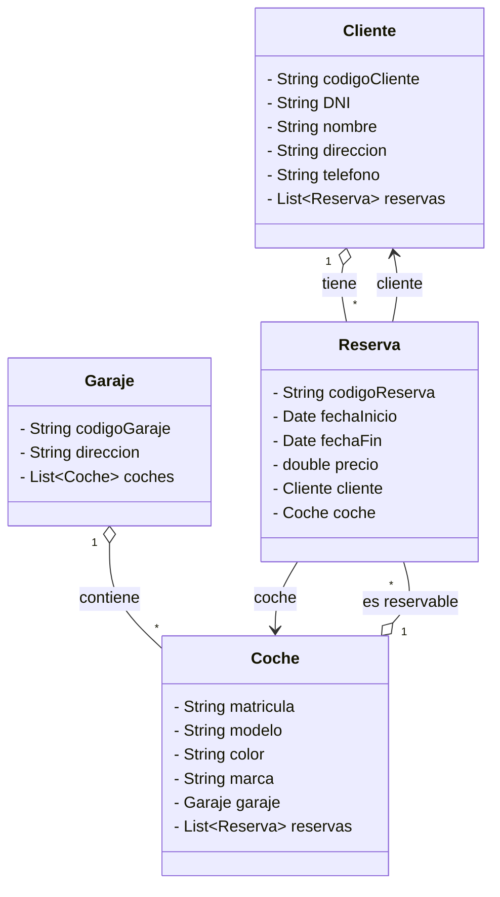

# 🛻 AlquilerCoches

Aplicación de gestión de reservas de coches desarrollada en **Java** con arquitectura en capas y patrón **DAO** (Data Access Object).

---

## 📋 Descripción

**AlquilerCoches** permite gestionar clientes, coches, garajes y reservas. La aplicación organiza clientes y coches en un sistema con reservas con fechas y precio.

El usuario interactúa con el sistema a través de un **menú de consola** que permite:

- Obtener una reserva de forma aleatoria.
- Buscar una reserva por su código identificador.
- Consultar todas las reservas registradas.

---

## 🏗️ Estructura del proyecto

```
src/
├── main/
│   └── java/
│       └── org/palomafp/
│           ├── App.java                   # Punto de entrada + menú de consola
│           └── modelo/
│               ├── AlquilerCochesDAO.java  # Capa de acceso a datos (DAO)
│               ├── Cliente.java            # Entidad Cliente
│               ├── Coche.java              # Entidad Coche
│               ├── Garaje.java             # Entidad Garaje
│               └── Reserva.java            # Entidad Reserva
└── test/
    └── java/
        └── org/palomafp/
            ├── AppTest.java               # Test básico de la aplicación
            └── modelo/
                └── AlquilerCochesDAOTest.java # Tests unitarios del DAO

``` 

## Diagrama de Clases 


--- 
## 🧩 Descripción de las clases

### `Cliente`
 Guarda el código de cliente, DNI, nombre, dirección, teléfono y lista de reservas.

###  `Coche`
 Guarda matrícula, modelo, color, marca, garaje y lista de reservas.

### `Garaje`
 Guarda código de garaje, dirección y lista de coches.

### `Reserva`
 Guarda código de reserva, fecha de inicio, fecha fin, precio, cliente y coche.

### `AlquilerCochesDao`
Inicializa los datos en memoria e implementa las operaciones de consulta:


| Método | Descripción |
|---|---|
| `getAllReserva()` | Devuelve la lista completa de reservas |
| `getGrupoByCodigo(int)` | Busca una reserva por su código |
| `getReservaRandom()` | Devuelve una reserva aleatoria |

### `App`
Clase principal con el método `main`. Gestiona el menú interactivo por consola mediante un bucle `do-while` y un `switch`.
--- 

## ▶️ Cómo ejecutar

### Requisitos

- Java 11 o superior
- Maven 3.x

### Compilar y ejecutar

```bash
mvn compile
mvn exec:java -Dexec.mainClass="org.palomafp.App"
```

## 🧪 Tests incluidos

Los tests se encuentran en `AlquilerCochesDaoTest.java` y prueban los siguientes casos:

| Test | Descripción |
|---|---|
| `testGetAllReserva` | Verifica que se devuelven exactamente 4 reservas |
| `testGetReservaRandom` | Comprueba que el reserva aleatorio no es nula  |
| `testGetReservabyId` | Verifica busqueda por codigo valido e invalido |

---
## 📦 Tecnologías utilizadas

| Tecnología | Uso |
|---|---|
| Java | Lenguaje principal |
| Maven | Gestión de dependencias y build |
| JUnit 5 | Framework de testing |
--- 