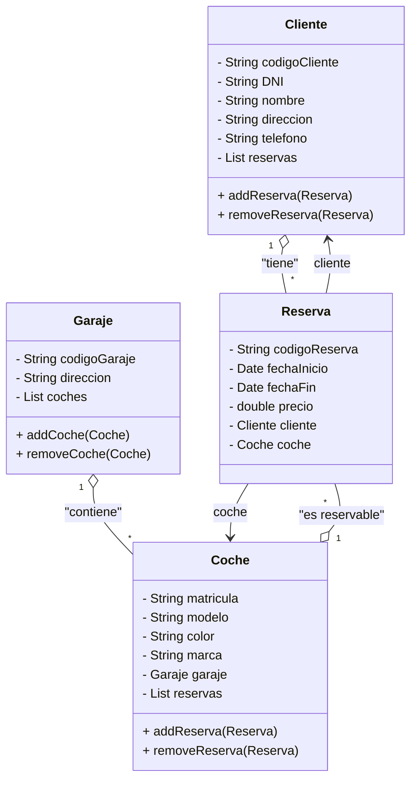

# Alquiler de Coches Maven

Proyecto Java de consola que gestiona el alquiler de coches. Construido con Maven y organizado en el paquete `org.palomafp`.

## 🚀 Visión general

- Gestión de clientes, coches, garajes y reservas
- Capa de modelo en `org.palomafp.modelo`
- Persistencia en memoria con `AlquilerCochesDAO`
- Pruebas unitarias con JUnit

## 📁 Estructura del proyecto

- `pom.xml`: configuración de Maven
- `src/main/java`: código fuente principal
  - `org.palomafp.App.java`: clase principal
  - `org.palomafp.modelo`: clases del dominio
    - `AlquilerCochesDAO.java`
    - `Cliente.java`
    - `Coche.java`
    - `Garaje.java`
    - `Reserva.java`
- `src/test/java`: pruebas unitarias
  - `org.palomafp.AppTest.java`
  - `org.palomafp.modelo.AlquilerCochesDAOTest.java`

## 🧩 Diagrama de clases (Mermaid)



## 🛠️ Requisitos

- Java 11 o superior
- Maven 3.6+

## ▶️ Uso

1. Compilar:
   ```bash
   mvn clean compile
   ```
2. Ejecutar:
   ```bash
   mvn exec:java -Dexec.mainClass="org.palomafp.App"
   ```
3. Ejecutar pruebas:
   ```bash
   mvn test
   ```

## 🤝 Contribuir

Forkear el repositorio, crear una rama y enviar un pull request.

## 📄 Licencia

MIT License (ajustar según proyecto).
