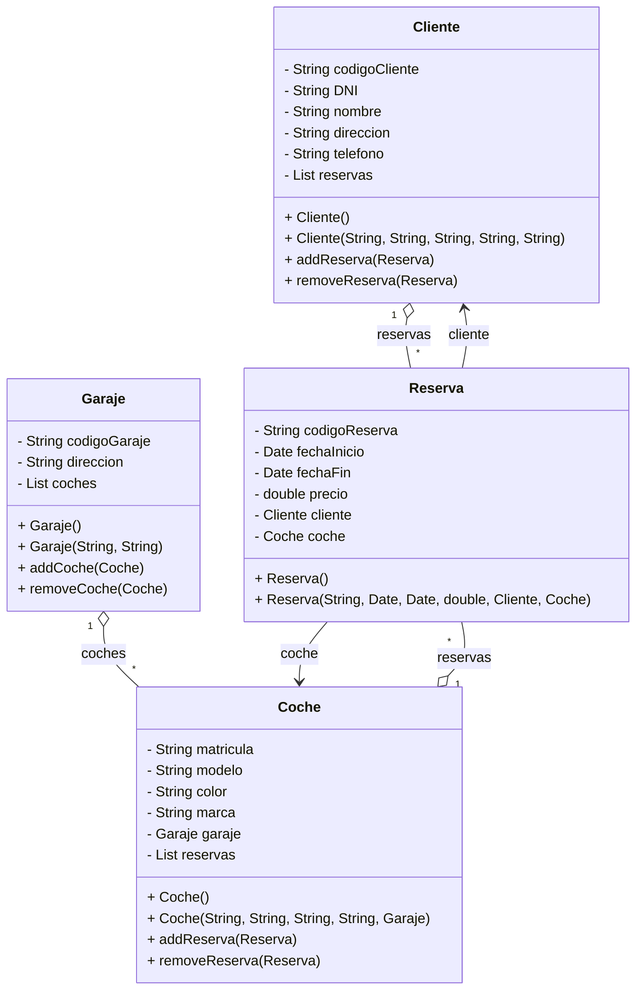

# Diagrama de clases (Mermaid)

```mermaid
classDiagram
    class Cliente {
        - String codigoCliente
        - String DNI
        - String nombre
        - String direccion
        - String telefono
        - List<Reserva> reservas
        + Cliente()
        + Cliente(String, String, String, String, String)
        + addReserva(Reserva)
        + removeReserva(Reserva)
    }

    class Coche {
        - String matricula
        - String modelo
        - String color
        - String marca
        - Garaje garaje
        - List<Reserva> reservas
        + Coche()
        + Coche(String, String, String, String, Garaje)
        + addReserva(Reserva)
        + removeReserva(Reserva)
    }

    class Garaje {
        - String codigoGaraje
        - String direccion
        - List<Coche> coches
        + Garaje()
        + Garaje(String, String)
        + addCoche(Coche)
        + removeCoche(Coche)
    }

    class Reserva {
        - String codigoReserva
        - Date fechaInicio
        - Date fechaFin
        - double precio
        - Cliente cliente
        - Coche coche
        + Reserva()
        + Reserva(String, Date, Date, double, Cliente, Coche)
    }

    Cliente "1" o-- "*" Reserva : reservas
    Coche "1" o-- "*" Reserva : reservas
    Garaje "1" o-- "*" Coche : coches

    Reserva --> Cliente : cliente
    Reserva --> Coche : coche
```
